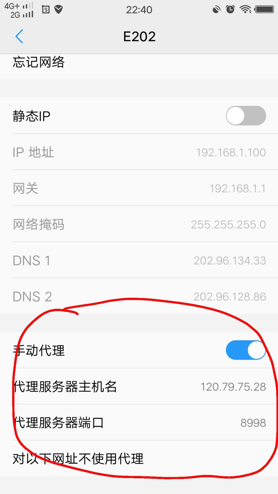

本项目fork于 https://github.com/sundy-li/wechat_brain.git
# anti-exam
答题辅助工具

## 使用原理
本工具运行在PC端,本质是一个http/https代理服务,对服务器接口请求进行截获,主要作用有

- 将题目和返回的标准答案存储于本地数据库中(questions.data文件)
- 未匹配到标准答案情况下,自动请求搜索引擎,注解形式返回最佳概率结果

## 使用步骤：
本工具必须结合PC和手机共同使用,PC和手机须在同一个网络下

#### 以下为PC电脑操作步骤

- 运行主程序。运行方法
	
	安装go(>=1.8)环境后, clone本repo源码, 进入源码目录后,执行 `go run main.go`。
- 新版本(version >= v0.18)加入了三种模式, 大家根据自己的需求选择模式运行
	1. 模式一: 默认模式, 修改了服务端返回的数据, 更加友好地提示正确答案,执行 `go run main.go`
	2. 模式二: 隐身模式, 严格返回原始数据, 该模式可以防止作弊检测(客户端提交返回题目和服务端对比,模式一很容易被侦测出使用了作弊, 模式二避免了这类检测), 但该模式的缺点是降低了用户的体验,题目答案的提示只能在PC电脑上显示, 运行方式执行 `go run main.go -m 1`
	3. 模式三：自动模式 ** 注意此模式不同手机点击可能不稳定, 谨慎使用 ** 安卓机的自动刷题模式，需要将手机连接到电脑，并安装adb，且需要在开发者模式中打开usb调试，使用前请根据自身手机分辨率，调整spider文件clickProcess中的相应参数：手机屏幕中心x坐标，第一个选项中心y坐标，排位列表中最后一项中心y坐标。运行方式执行 `go run main.go -a 1 -m 1`

#### 以下为手机安装步骤

- 设置手机代理。手机连接wifi后进行代理设置，代理IP为个人pc的内网ip地址,以及端口为8998,移动网络下可通过设置新建APN并在其中设置代理的方式实现。如：

    
 

 

- 安装证书。代理运行成功后,手机浏览器访问 `abc.com`安装证书,ios记得要信任证书 (或者将 `certs/goproxy.crt`传到手机, 点击安装证书), 很多朋友会卡在安装证书这一步骤, 不同手机会有不同的安装方式,建议大家多搜索下自己机型如何安装证书

